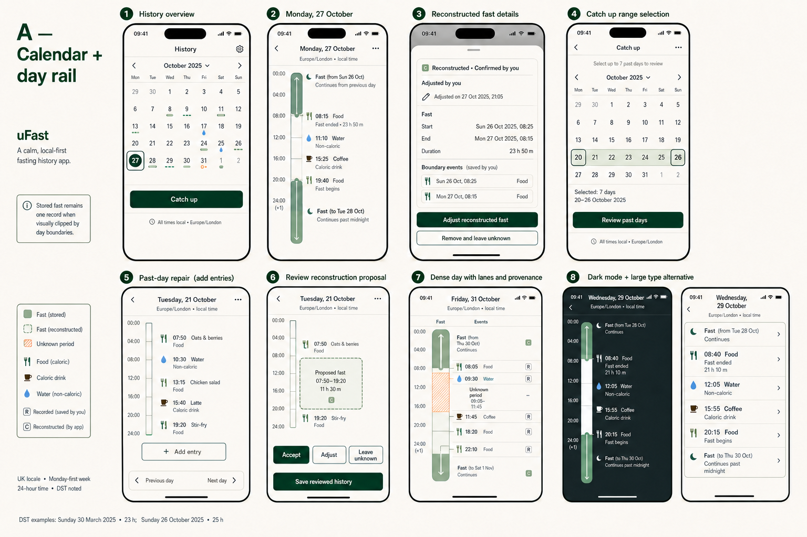
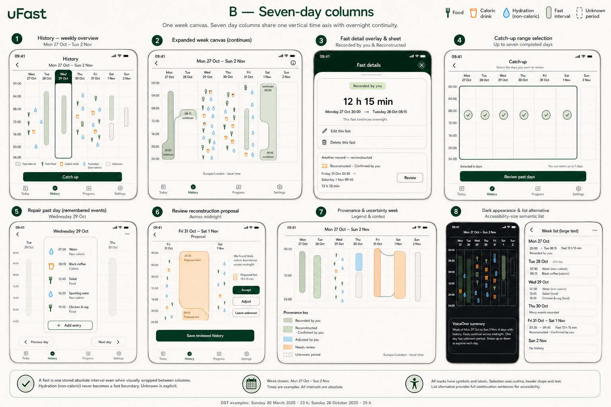
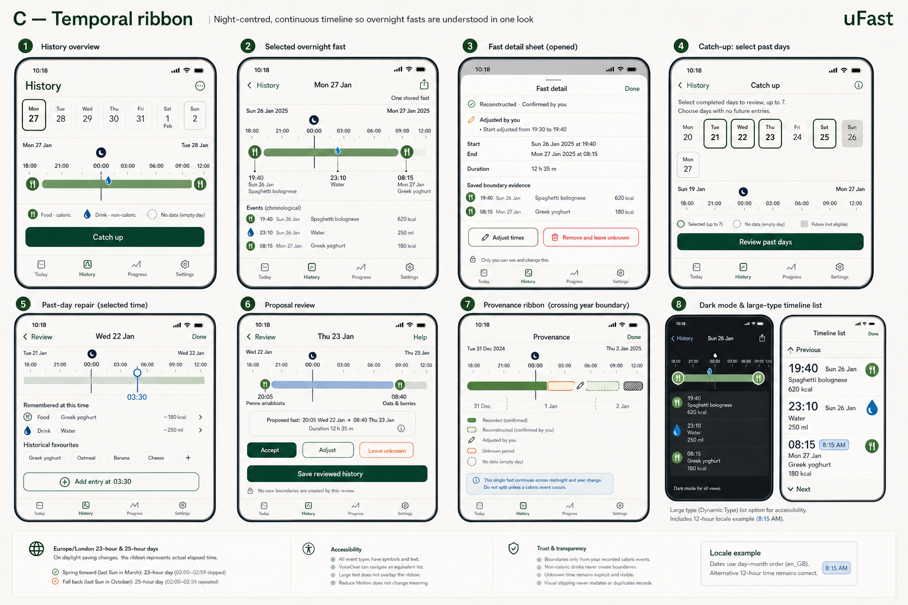

# Slice 3.5 — Visual history and catch-up experience

**Sprint status:** OW-350 complete; explicit direction approval required  
**Production status:** Not started  
**Story order:** OW-350 → OW-351 → OW-352 → OW-353 → OW-354 → OW-355

This pack defines a presentation, navigation and interaction-design sprint over
the completed Slice 3 implementation. It does not change domain behaviour,
persistence, reconstruction, validation, invalidation, provenance or any Slice
1–3 acceptance criterion.

## Behaviour-preservation gate

The redesign is feasible without product-behaviour changes.

The current records and services already provide every fact the visual layer
needs: absolute fast intervals, food and hydration instants, explicit hydration
classification, recorded/reconstructed origin, adjusted state, review state,
supporting boundary references, unknown periods and atomic review/save
operations. Presentation models can consume these values without mutating them.

The following proposals were excluded because they would require new semantics
or an unjustified trust claim:

- completion marks, streaks, scores, adherence rings or “missed” days;
- inferred eating windows, inferred day completeness or midnight boundaries;
- daily/weekly averages, totals or comparative statistics;
- biological fasting stages, coaching or health claims;
- saving a historical favourite without confirming its occurrence time;
- splitting an overnight fast into day-owned records;
- persistence of viewport segments, lanes, selected dates or chart geometry.

## OW-350 — Research and approve the visual direction

**Status:** Complete, awaiting explicit approval  
**Gate:** OW-351 must not begin until a direction is approved and recorded in
`DECISIONS.md`.

### Current journey review

The implementation and tests were reviewed together with all existing images.
The live seeded app was also inspected on an iPhone 16e and an iPhone 17 Pro Max
simulator using the completed Slice 3 data.

#### History today

1. History opens as a newest-first list.
2. Catch up is the first action row.
3. Unknown, Needs review, reconstructed and adjusted states are separate cards.
4. A recorded card opens the existing completed-fast editor.
5. A reconstructed card opens provenance detail or changed-history review.
6. Unknown opens its bounded detail and explicit marker-removal action.

What works:

- trust states are named in text and exposed in VoiceOver;
- destructive and converting actions remain progressively disclosed;
- one primary Catch-up entry is easy to find;
- persistence failures preserve the editor and saved record;
- cards reflow and remain operable at narrow width.

What does not yet meet Slice 3.5:

- an overnight interval is still understood by comparing two timestamps;
- fasts, food and drinks are not shown in chronological relationship;
- the list gives weak day/week orientation and no selected-day model;
- the Pro Max mainly produces wider cards rather than more temporal context;
- provenance cards consume most of the 16e viewport before a second day can be
  understood;
- an empty date is not represented because only records are represented.

#### Catch up today

1. A sheet opens a From/To form, defaulting to seven completed days.
2. Review past days moves to one day at a time in chronological order.
3. Each day is a chronological event-card list with Add entry and previous/next.
4. Historical favourites open the full editor.
5. Generate proposals opens proposal cards.
6. Every proposal is Accept, Adjust or Leave unknown before one atomic save.

What works:

- the range and sequence are explicit and calm;
- empty copy says to add only what the user remembers;
- review and final-save boundaries are clear;
- all existing D-013, BR-17 and rollback paths remain in their services.

What does not yet meet Slice 3.5:

- range selection, day repair and proposal review look like separate forms;
- the user relearns navigation after leaving History;
- the selected range has no visual temporal relationship to saved history;
- an empty wide screen carries unused space rather than week/day orientation;
- proposal cards explain boundaries textually but do not show them in situ.

### Native iOS research

| Reference | Useful pattern for uFast | Conflict or caution | Overnight treatment |
| --- | --- | --- | --- |
| Apple Calendar | Month, multi-day and list representations; compact/stacked/detail density choices; tap or rotate for more context | Calendar events are editable appointments, so drag-to-reschedule must not be copied into read-only History | Day/week rails make duration spatial; uFast additionally needs continuation semantics at viewport edges |
| Apple Health Sleep | Week/month range controls, horizontal graph paging and tap-a-day disclosure | Sleep stages and cumulative analysis would imply evidence uFast does not have | A single night reads as a continuous band, making it the strongest reference for overnight comprehension |
| Apple Health Cycle Tracking | Horizontally selectable week navigator with selected-day detail below | Prediction marks and health semantics are out of scope | Date context stays visible while detail changes beneath it |
| Apple Health Medications | Select a date at the top, then act on a structured day list | Taken/skipped states encode adherence and must not influence blank-day styling | Not interval-led; useful only for navigator/detail hierarchy |
| Native sheets | Scoped detail related to the selected context; progressive disclosure at a medium detent where appropriate | Avoid stacking sheets or placing the whole journey in transient layers | Good for fast/event detail while retaining timeline context |
| Apple chart accessibility | Text summary, per-mark semantics, shapes/patterns in addition to colour, logical navigation and chart descriptors | A visual timeline cannot be the only representation | Requires an equivalent grouped list or chart descriptor for every timeline |

Sources: [Calendar views](https://support.apple.com/en-asia/guide/iphone/iphfd1054569/ios),
[Calendar event detail](https://support.apple.com/guide/iphone/create-and-edit-events-in-calendar-iph3d110f84/ios),
[Health Sleep history](https://support.apple.com/en-ae/guide/iphone/view-your-sleep-history-iph72b370881/ios),
[Cycle Tracking](https://support.apple.com/guide/iphone/log-menstrual-cycle-information-iph51a822b18/26/ios/26),
[Medications](https://support.apple.com/en-ie/guide/iphone/iph811670c81/ios),
[Sheets HIG](https://developer.apple.com/design/human-interface-guidelines/sheets),
[Charts HIG](https://developer.apple.com/design/human-interface-guidelines/charts), and
[SwiftUI chart descriptors](https://developer.apple.com/documentation/swiftui/view/accessibilitychartdescriptor%28_%3A%29?changes=_11%2C_11).

### Third-party interaction references

Third-party products were treated only as interaction references.

| Reference | Useful pattern | Rejected pattern |
| --- | --- | --- |
| Zero | Short calendar plus tap-through detail; visible history editing | Progress pillars, goal/completion framing and motivational language |
| Fastic | Explicit historical fast entry and preventing overlap | Celebration, “making fasts count”, commercial mechanics and status framing |
| Sleep Cycle | A night as one left-to-right timeline with event pins | Algorithmic stages, scoring, diagnosis-adjacent claims and coaching |
| Fitbit/Google sleep | Press/drag exploration of a night and aligned event detail | Stage inference, benchmarks, scores and 30-day analysis |

Sources: [Zero history calendar](https://zerofasting.zendesk.com/hc/en-us/articles/360041323933-Me-Tab-Tracking-Your-Progress),
[Fastic historical fast entry](https://fastic.freshdesk.com/support/solutions/articles/47001220440-how-do-i-add-a-fast-to-my-fasting-history-),
[Sleep Cycle night graph](https://sleepcycle.com/sleep-talk/track-sleep-cycle-stages), and
[Google/Fitbit sleep timeline](https://support.google.com/googlehealth/answer/14236712?hl=en).

### Concept family A — Calendar navigator + selected-day rail

Strengths:

- strongest familiar date and month orientation;
- neutral blank dates are straightforward;
- selected-day detail has generous width on a narrow iPhone;
- progressive disclosure and native sheet routing are clear;
- lowest accessibility and implementation risk of the three.

Weaknesses:

- a fast crossing midnight is clipped at the top/bottom of a day viewport;
- repeated/missing DST hours make a literal vertical clock rail non-uniform;
- switching month overview to day rail is a larger context transition;
- dense days require lane allocation and vertical scrolling.

Overnight treatment: one interval maps to two viewport segments for display
only, with “continues from/to” markers and one record detail identity.

UK/DST treatment: native calendar ordering, day–month labels, locale time
formatting, and variable 23/25-hour day geometry. Never divide by 24 hours.

Accessibility risk: low-to-medium. Provide a day summary and grouped semantic
list; do not make the rail the only navigable representation.

Implementation complexity: **Medium**.

### Concept family B — Seven-day columns

Strengths:

- strongest week-at-a-glance comparison without adding statistics;
- interval continuity across day boundaries is spatially explicit;
- Catch up range selection naturally reuses the same canvas;
- density and unknown periods are visible in context.

Weaknesses:

- seven columns are too narrow for reliable direct selection on the 16e;
- labels and event marks compete at Dynamic Type sizes;
- 23/25-hour days cannot honestly share a simplistic equal 24-hour axis;
- the canvas can become a dashboard and overemphasise empty space;
- selected-column expansion adds another interaction mode.

Overnight treatment: the same record wraps between adjacent column edges using
linked continuation geometry.

UK/DST treatment: columns must derive their own local-day intervals and expose
BST/GMT transitions. Equal visual height is acceptable only if the axis clearly
switches to local-clock categories rather than claiming elapsed-time scale.

Accessibility risk: high. Requires a week summary, day grouping and semantic
list; individual marks are too small to be primary controls.

Implementation complexity: **High**.

### Concept family C — Night-centred temporal ribbon

Strengths:

- an overnight fast reads as one continuous shape across a labelled midnight;
- compact date chips preserve context while detail changes below;
- History, day repair and proposal review share one recognisable grammar;
- chronological event list provides a natural semantic alternative;
- narrow-phone use is clearer than compressed week columns.

Weaknesses:

- a night-centred lens needs an explicit path to daytime events outside the
  initial band;
- horizontal panning and time selection need generous hit targets;
- a custom ribbon is less immediately familiar than a native calendar;
- month navigation is weaker without a subordinate jump control.

Overnight treatment: evening, midnight and morning are in one continuous band;
the detail sheet retains the single record and absolute duration.

UK/DST treatment: marks are positioned from actual instants within a displayed
date interval, repeated hours include BST/GMT context, and 12-hour locales
reformat labels without changing geometry.

Accessibility risk: medium. The ribbon needs a concise summary, adjustable
previous/next item actions and a grouped timeline list at all sizes.

Implementation complexity: **Medium-high**.

### Decision matrix

| Criterion | A | B | C |
| --- | ---: | ---: | ---: |
| Day/month orientation | 5 | 4 | 4 |
| Overnight comprehension | 3 | 4 | 5 |
| Narrow-iPhone clarity | 5 | 2 | 4 |
| Catch-up reuse | 4 | 5 | 5 |
| Dynamic Type resilience | 4 | 2 | 4 |
| DST honesty | 4 | 2 | 4 |
| Implementation simplicity | 4 | 2 | 3 |
| Calm uFast character | 5 | 3 | 5 |

Scores compare the families only; they are not product metrics.

### Recommended direction

Recommend **Family C — Temporal ribbon** as the core direction.

It best answers the sprint's distinctive requirement: understand an overnight
fast without mentally comparing timestamps. It also gives History, past-day
repair and proposal review one temporal grammar while staying calm on the
narrow phone.

Two subordinate elements from A can be combined coherently:

1. an optional native month jump sheet behind the date navigator; and
2. A's explicit continuation copy and grouped semantic list treatment.

The month grid should not become a second competing overview, and B's
seven-column canvas should not be combined with the ribbon. That would create
two axes, excessive density and an accessibility burden.

### Approval required

Approve one of the following before OW-351:

- **C — Temporal ribbon (recommended)**, with the two subordinate A elements;
- **A — Calendar + day rail**;
- **B — Seven-day columns**; or
- request a targeted revision to one family.

After approval, record the accepted direction in `DECISIONS.md`. Do not begin
production implementation before that edit is accepted.

---

## OW-351 — Establish temporal presentation primitives

**Status:** Not started; blocked by OW-350 approval

### Scope

- immutable presentation values for selected date/period and visible records;
- local-day/date-range resolution using injected Calendar, Locale and TimeZone;
- viewport clipping and continuation markers without record mutation;
- event positioning, stable ordering and deterministic lane allocation;
- provenance/unknown presentation roles and VoiceOver summaries;
- narrow/wide geometry policies and semantic-list output.

### Acceptance criteria

- Same-day and overnight intervals map deterministically.
- Month/year and time-zone boundaries preserve record identity and instants.
- Europe/London spring and autumn transitions cover 23- and 25-hour days.
- en_GB and at least one 12-hour locale produce unambiguous labels.
- Clipping never writes, duplicates or splits a record.
- Equal-time events retain Slice 2 ordering.
- Recorded, reconstructed, adjusted, Needs review and unknown are textually
  distinct without colour.
- Narrow/wide policies are deterministic and Dynamic Type has a list fallback.
- Every custom/Chart representation has a structured VoiceOver equivalent.

---

## OW-352 — Redesign History overview

**Status:** Not started

### Acceptance criteria

- The current period and selected date are explicit.
- Blank dates are neutral and never imply failure.
- Selection is visible without colour alone.
- Fasts, food, caloric drinks and non-caloric drinks use text, shape and symbol.
- Unknown is explicit; Needs review is noticeable but calm.
- Catch up remains the one obvious primary action.
- Detail remains progressively disclosed.
- Existing identifiers are retained where practical and intentional replacements
  update UI tests.
- Existing Slice 1–3 repositories and saves are unchanged.

---

## OW-353 — Add visual day detail and record disclosure

**Status:** Not started

### Acceptance criteria

- Fast intervals and food/hydration entries share chronological context.
- An overnight fast visibly crosses midnight or carries explicit continuation
  without suggesting two records.
- Tapping an item opens an accessible native sheet/destination.
- Recorded editing, reconstructed evidence, adjusted state, Needs review,
  unknown detail, event CRUD and destructive confirmations remain available.
- Timeline drawing code never coordinates saves.
- Dense events use deterministic visual lanes without implying saved fast
  overlap.

---

## OW-354 — Rework Catch up around the shared temporal model

**Status:** Not started

### Acceptance criteria

- The existing one-to-seven completed-day range and default remain unchanged.
- Days are reviewed chronologically with the accepted navigator/timeline.
- Historical event CRUD preserves the existing editors and rules.
- Historical favourites always open the editor and never invent a time.
- Proposal generation, per-proposal review and one final atomic save are
  unchanged.
- Range edges, boundary extraction, eight-hour threshold, BR-17, D-013,
  invalidation and rollback remain unchanged.
- Catch up feels like a continuation of History rather than a separate model.

---

## OW-355 — Complete visual integration and quality gate

**Status:** Not started

### Acceptance criteria

- History, detail, Catch up, reconstruction review and changed history use one
  coherent temporal language and one primary action per screen.
- Light, dark, increased contrast, Dynamic Type accessibility sizes, VoiceOver,
  Reduce Motion, narrow/wide phones and offline operation pass.
- en_GB, a 12-hour locale, Monday-first handling and Europe/London 23/25-hour
  transitions pass.
- Empty, dense, unknown, reconstructed, adjusted and Needs review states pass.
- Three-day repair, persistence failure and atomic rollback pass.
- Slice 1–3 data migrates without mutation or destructive migration.
- Formatting, project generation if required, build, unit/UI tests, lint and
  `git diff --check` pass.
- If exactly one iPhone is connected, the principal journeys are repeated on
  device without resetting existing data.

## Final completion report contract

Report the accepted direction, changed files, reusable primitives,
accessibility treatment, locale/DST verification, migration impact, full
verification, assumptions and remaining device/visual risks.
