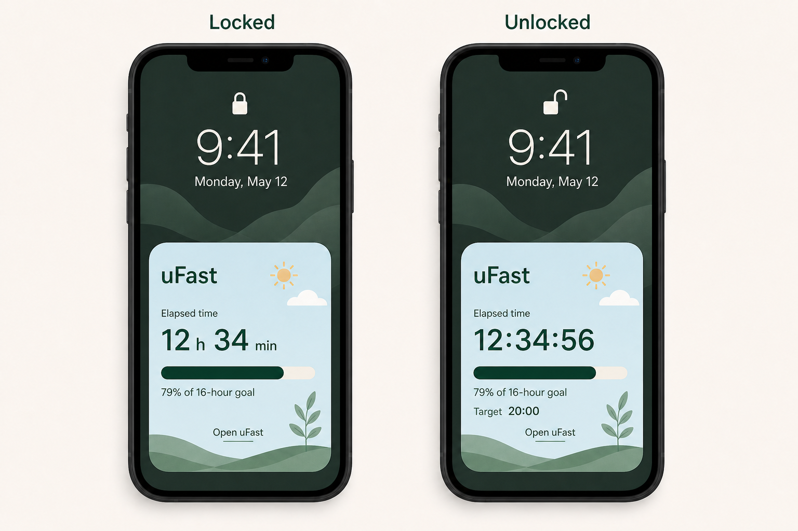

# uFast Lock Screen fasting surface

**Stories:** OW-L101 to OW-L109  
**Status:** OW-L101 through OW-L105 delivered; OW-L106 through OW-L109 Sprint Ready  
**Prepared:** Updated 9 August 2026  
**Milestone:** Roadmap 1 — Lock Screen fasting surface

## Outcome

An active user-recorded fast is calmly glanceable from the iPhone Lock Screen
without opening uFast. The surface is optional, local-only and never becomes a
second fasting record. The in-app fasting loop remains complete when the widget
is absent, hidden, stale or unavailable.

The intended timer treatment is:

- while protected Lock Screen content is being privacy-redacted, show completed
  hours and minutes only, for example **12 h 34 min**;
- after authentication, show the same elapsed interval with counting seconds,
  for example **12:34:56**; and
- never persist timer ticks or claim second-by-second biological precision.

Both states include the same goal progress bar used by the uFast Today active-fast
hero. It shows elapsed divided by the captured goal, clamps visually at 100%,
and has a text/VoiceOver equivalent such as **79% of 16-hour goal**. The Lock
Screen surface reuses Today's soft sky hero field, deep evergreen hierarchy,
rounded geometry, monospaced timer digits and restrained botanical treatment,
adapted to the much smaller system widget family.

> **Concept, not an OS-layout specification.** The visual communicates hierarchy,
> content and precision. Final WidgetKit geometry, tap affordances, redaction and
> type sizes must follow the system families available on the deployment target.

## Product rules carried into every story

- The active `FastRecord` in the local SwiftData store is authoritative.
- Only an explicit successful start creates a persisted fast. A widget never
  starts, ends, edits or infers a fast.
- All presentation uses absolute start and target instants. Locale and time-zone
  changes affect formatting only; daylight-saving changes never alter duration.
- The feature is optional and non-blocking. It uses no account, network, remote
  push, analytics, notification permission or HealthKit permission.
- Copy describes the recorded interval. It does not use biological stages,
  coaching, streaks, celebration, warning or medical claims.
- Progress is the same pure `elapsed / goal duration` presentation used by
  Today, clamped from 0% to 100%. It never implies biological completion and
  never resets or grows beyond a full track after the goal is reached.
- System-surface failure never rolls back or blocks a local fasting operation.
- No food, hydration, nutrition, weight, step, history or note content crosses
  into the widget projection.
- Delete All Data removes the derived projection as well as the authoritative
  records; a missing or unreadable projection fails closed.

## Delivery sequence

The user-added WidgetKit Lock Screen widget was built first and physically
verified under OW-L102. OW-L103 then accepted Option B: retain that durable
surface and add a separately requested Live Activity. OW-L104 established the
safe current-fast route and OW-L105 delivered the explicit per-fast ActivityKit
baseline. D-030 now amends that baseline with informed, reversible automatic
behavior. Its implementation-ready stories are maintained in
`docs/OW_LIVE_ACTIVITY_AUTOMATION_STORIES.md`.

Current order: **OW-L101 → OW-L102 → OW-L103 → OW-L104 → OW-L105 → OW-L106 →
OW-L107 → OW-L108 → OW-L109**.

---

## OW-L101 — Lock Screen privacy, precision, lifecycle and stale-state contract

**Epic:** Lock Screen fasting surface  
**Priority:** P0  
**Status:** Done — D-028 accepted 8 August 2026  
**Estimate:** 3 points (time-boxed product/technical spike)  
**Depends on:** D-007, D-009, D-025, D-027; BR-03, BR-12, BR-15, BR-26, BR-28

### User story

As a privacy-conscious user, I want uFast to define exactly what may appear,
when it updates and how it fails on the Lock Screen, so that a convenient glance
never becomes an unexpected disclosure or a competing fasting record.

### Why now

OW-L102 needs a settled contract before adding an extension, shared container or
system-facing UI. The desired locked/unlocked precision also needs proof on a
physical iPhone: WidgetKit exposes privacy redaction state, not a general-purpose
device-lock API, and system rendering remains authoritative.

### In scope

- Produce an executable WidgetKit prototype for the rectangular Lock Screen
  family using an absolute start instant and system-driven dynamic date/timer
  text.
- Verify on a physical supported iPhone whether privacy redaction can reliably
  render completed hours/minutes while protected and counting seconds after
  authentication without timeline entries every second.
- Verify behavior for Lock Screen, authenticated Lock Screen, Always-On reduced
  luminance where available, device restart-before-first-unlock and the user's
  Lock Screen widget data-access setting.
- Finalize a content matrix for active, no-active, privacy-redacted, invalid,
  unreadable, future-start and ended states.
- Finalize a visual mapping from Today's `ActiveFastProgressView` and
  `UFastThickProgressStyle` into the rectangular widget, preserving information
  hierarchy, semantic colors and progress meaning without copying an in-app
  layout that cannot fit the system family.
- Define a versioned, rebuildable `ActiveFastWidgetProjection` containing only:
  schema version, active record identifier, absolute start, absolute target,
  captured whole-hour goal and projection generation date.
- Choose an App Group identifier and file-protection level. Store the projection
  as an atomic derived file, never as a second editable record or second
  SwiftData store.
- Define update ordering: write or clear the projection and request a widget
  reload only after the corresponding SwiftData transaction commits.
- Define stale behavior. Because elapsed time derives from absolute instants,
  age alone is not stale; incompatible schema, corrupt/missing required fields,
  a target not after start, a start materially in the future, or a projection
  invalidated by Delete All Data is unavailable and must not display a duration.
- Define neutral, localized copy and VoiceOver summaries. Counting seconds are
  visual information sampled when VoiceOver focuses the element, never a live
  announcement every second.
- Record the accepted contract in `DECISIONS.md` and add any new domain rule to
  `DOMAIN_RULES.md` before OW-L102 merges.

### Out of scope

- Shipping a production widget or deep link.
- ActivityKit, Dynamic Island, notifications, App Intents or interactive fast
  controls.
- Moving the authoritative SwiftData store into the App Group.
- Background polling, per-second persistence or a network source.

### Acceptance criteria

1. Given the prototype contains a valid active projection, when the protected
   presentation is privacy-redacted, then it shows only the accepted locked
   content and completed hours/minutes; seconds are absent.
2. Given the same projection and the person authenticates, when WidgetKit removes
   privacy redaction, then the elapsed presentation includes counting seconds
   derived from the same absolute start without app execution or persisted ticks.
3. Given the operating system or user privacy setting does not expose a reliable
   redaction transition, then the spike records the observed behavior and P1 is
   resolved to one truthful supported fallback before OW-L102 begins.
4. Given Always-On reduced luminance, then essential content remains legible,
   motion-free and no more revealing than the normal locked presentation.
5. Given no active projection, an invalid projection, unreadable protected data
   or a future start, then the contract displays no invented elapsed duration and
   provides a neutral open-uFast/no-active treatment.
6. Given a valid projection crosses a London daylight-saving transition or the
   display time zone changes, then elapsed duration preserves the same absolute
   instants and the target is formatted in the current locale and time zone.
7. Given start, correction, goal change, end or Delete All Data fails to commit,
   then the previous projection remains unchanged; after a successful commit,
   the projection is atomically updated or cleared and a reload is requested.
8. Given the projection file or activity content is inspected, then it contains
   no food, hydration, nutrition, weight, steps, notes, history collection,
   analytics identifier or network token.
9. Given VoiceOver focuses elapsed time, then it receives one coherent localized
   value appropriate to the current privacy state and is not interrupted by
   recurring second announcements.
10. Given a valid active projection, then the prototype's progress fraction and
    accessible percentage equal Today's result for the same start, target and
    current instant; below zero it is 0%, and at or beyond goal it is 100%.
11. The accepted decisions, prototype evidence, screenshots and limitations are
    committed to the repository; no production capability is enabled by the
    spike alone.

### Verification

- Unit-test projection validation, precision formatting, invalid-state mapping,
  DST and time-zone behavior with `AppClock` and deterministic calendars.
- Inspect the App Group file and its protection attributes on device.
- Capture device evidence before and after authentication and in reduced
  luminance; simulator evidence alone is insufficient.
- Confirm no extension timeline schedules per-second entries and no timer tick is
  persisted.

### Done when

The four decisions below are accepted, the precision behavior is proven or
truthfully reduced to an accepted fallback, and OW-L102 has a stable privacy,
data and lifecycle contract with no open implementation-changing question.

---

## OW-L102 — Accessible active-fast Lock Screen widget

**Epic:** Lock Screen fasting surface  
**Priority:** P0  
**Status:** Done; device verification confirmed 8 August 2026  
**Estimate:** 8 points  
**Depends on:** OW-L101

### User story

As a user with an active fast, I want an optional Lock Screen widget that shows
my elapsed time at a glance, so that I do not need to open uFast merely to check
the recorded interval.

### In scope

- Add one WidgetKit extension and the accepted App Group/capabilities through
  `project.yml`, then regenerate `uFast.xcodeproj`; do not hand-edit it.
- Ship the accessory rectangular Lock Screen family first. Additional families
  require evidence that their content remains understandable and are not part of
  this story.
- Add a pure, Foundation-only projection model and formatter shared by app and
  extension without importing SwiftData into the extension.
- Mirror the one active fast into the versioned atomic projection only after
  successful start, backdated start, active-start correction or current-goal
  change. Clear it only after successful end, active deletion or Delete All Data.
- Request `WidgetCenter` reloads after successful projection changes. Timeline
  entries may cover predictable state boundaries, but must not attempt a
  per-second refresh schedule.
- Render the OW-L101 locked/unlocked precision contract using system-supported
  dynamic date/timer views. Continue elapsed time beyond target; show neutral
  **Goal time reached** only if the accepted compact layout has room.
- Reuse the pure progress calculation and semantic visual roles from Today's
  active-fast hero. Render a thick rounded progress track and fill with an
  adjacent text and VoiceOver percentage; do not rely on fill color alone.
- Match Today's soft sky hero surface, deep evergreen text/fill, rounded shape,
  monospaced timer and restrained botanical character while allowing WidgetKit
  to control the actual family geometry, margins and rendering environment.
- Render a neutral no-active/unavailable state that invites opening uFast and
  never shows a duration from invalid or unprotected data.
- Apply privacy-sensitive redaction, reduced-luminance treatment, sufficient
  contrast, monospaced digits where helpful and a coherent accessibility label.
- Keep the widget read-only. A tap launches uFast through the route implemented
  by OW-L104; no Start, End, Edit or goal-changing control is present.
- Add an in-app Settings explanation describing what can be visible while the
  phone is locked and how to add/remove the system widget. Do not pressure the
  user to install it.

### Out of scope

- Live Activities, Dynamic Island and remote updates.
- Home Screen, StandBy-specific, watchOS or macOS families.
- Interactive fast controls, notifications or automatic widget installation.
- Reading the primary SwiftData store from the extension.

### Acceptance criteria

1. Given no widget has been added, then every in-app fasting journey remains
   unchanged and no prompt blocks or repeats.
2. Given a user adds the widget and a fast is active, when the system renders it
   in the locked privacy state, then completed hours/minutes are visible under
   the accepted P1 contract and counting seconds are not.
3. Given the same widget after authentication, then counting seconds appear
   under the accepted P1 contract and derive from the same absolute start as
   Today's timer.
4. Given uFast is suspended or terminated, then supported system dynamic text
   continues to advance without networking, persisted ticks or second-by-second
   timeline entries.
5. Given the target is reached, then elapsed time continues without celebration,
   alarm, warning or biological claim and without requiring an app launch; the
   progress track remains full and does not imply progress beyond 100%.
6. Given a start, correction or goal change commits, then the widget projection
   and visible presentation converge on the committed record; a failed or
   cancelled operation leaves the previous projection intact.
7. Given ending the fast or Delete All Data commits, then the active projection
   is cleared and the next widget render contains no ended-fast duration; a
   failed commit does not clear it.
8. Given corrupt, incompatible, unavailable or protected data, then the extension
   fails closed to the accepted neutral state and never crashes or guesses.
9. Given VoiceOver, increased contrast, Reduce Motion, reduced luminance or the
   largest supported widget text environment, then elapsed meaning remains
   understandable without relying only on color, motion or punctuation.
10. Given the same active record, goal and current instant, then Lock Screen and
    Today show the same clamped progress percentage and equivalent accessible
    text; the widget's visual treatment is recognizably derived from Today's
    active-fast hero.
11. Given a London DST boundary, 12/24-hour locale change or display time-zone
    change, then duration preserves absolute time and target formatting follows
    the current environment.
12. Given the app and extension are inspected, then they use no network, remote
    push, analytics, HealthKit or additional persisted fasting history.

### Implementation seams

- `ActiveFastWidgetProjection`: Codable, Sendable, schema-versioned value type.
- `ActiveFastProjectionStore`: protocol with atomic read/write/clear; production
  App Group adapter and deterministic in-memory fake.
- `ActiveFastProjectionCoordinator`: called after committed domain mutations.
- `LockScreenFastPresentation`: pure state mapping and localized accessibility
  values; no SwiftUI dependency where practical.
- Widget timeline provider: validates projection and chooses active/no-active/
  unavailable entries; it does not own persistence semantics.

### Verification

- Unit tests for projection encoding, validation, store failure, coordinator
  ordering, formatters, no-active states and DST/time-zone cases.
- Widget previews or snapshots for locked, unlocked, no-active, goal-reached,
  corrupt/unavailable, 0%, partial and 100% progress, dark/light and
  accessibility conditions.
- Integration tests proving every relevant successful mutation reloads only
  after commit and every failure leaves the projection unchanged.
- Physical-device checks for authentication redaction, Always-On where available,
  restart-before-first-unlock, offline use and removal/re-addition.
- Run `make project`, `make build`, `make test`, `make lint`, and deploy to a
  connected iPhone when available.

### Done when

The optional rectangular Lock Screen widget passes all acceptance criteria on a
supported physical iPhone and its absence or failure cannot affect fasting data.

**Device verification:** Confirmed by the user on 8 August 2026. The accepted
OW-L101 privacy fallback remains operative; no change to D-028 is implied.

**Active-state crash regression:** Resolved and reverified on the affected
iPhone on 8 August 2026. Device evidence showed that the App Group projection
was valid, but combining the system timer's dynamic accessibility child with
the widget accessibility tree crashed SwiftUI while WidgetKit archived the
active view. The active widget now exposes one stable VoiceOver summary and
hides the redundant timer/progress child nodes. The final installed build
rendered with the extension remaining alive and produced no new crash report.

---

## OW-L103 — Decide whether an optional Live Activity is required

**Epic:** Lock Screen fasting surface  
**Priority:** P1  
**Status:** Done — Option B accepted 8 August 2026  
**Estimate:** 3 points (time-boxed)  
**Depends on:** OW-L101 and an OW-L102 device prototype

### User story

As the product team, we want evidence that a Live Activity adds durable user
value beyond the Lock Screen widget, so that uFast does not add a more exposed,
short-lived system surface without a clear benefit.

### Accepted decision

**B — Widget plus optional Live Activity.** The product owner selected Option B
after OW-L102 was completed and physically verified. The user-added widget stays
the durable Lock Screen surface. A Live Activity adds an explicitly requested,
temporary Dynamic Island and richer Lock Screen presentation; it is never the
only way to observe or manage a fast.

The implementation contract is OW-L105. It resolves the former open choices as
follows:

- default off, with a separate per-fast **Show Live Activity** action;
- no persistent setting that silently starts an activity for later fasts;
- Dynamic Island Lock Screen, compact, minimal and expanded layouts are in
  scope, with truthful fallback on devices without Dynamic Island;
- one matching activity at a time, requested only after the active fast exists;
- no automatic start, restart, chaining or background extension;
- after ActivityKit's eight-hour active limit, the local fast and WidgetKit
  widget continue; the Live Activity may follow the system's ended-state Lock
  Screen retention and is never treated as active fasting state;
- a person may explicitly choose **Show Live Activity again** for the same still-
  active fast after dismissal or system ending, after seeing the same disclosure;
- successful fast end, active-fast deletion and Delete All Data end every
  matching activity with immediate dismissal; and
- no notification, remote push, background task, account, analytics or network
  dependency is added.

### Evaluation questions

- Does OW-L102 meet locked hours/minutes and authenticated counting seconds on a
  physical device without an ActivityKit surface?
- Do target users value Dynamic Island or automatic appearance enough to justify
  additional exposure and lifecycle complexity?
- What happens at the eight-hour system end during a 12–24 hour fast? A silent
  disappearance or automatic restart loop is not acceptable.
- Would an explicit per-fast **Show Live Activity** action remain calm, or create
  a confusing second opt-in beside the user-added widget?
- Can one source projection and one deep link serve both surfaces without making
  ActivityKit state authoritative?
- Does the UI remain truthful on devices without Dynamic Island and when Live
  Activities are disabled or dismissed by the user?

### Evidence and rationale

- OW-L102 is complete and physically verified, so the WidgetKit surface remains
  the reliable long-duration path.
- Apple documents an eight-hour maximum active lifetime. The system then removes
  the activity from Dynamic Island and may retain its ended presentation on the
  Lock Screen for up to four further hours. This cannot truthfully cover every
  uFast goal, which ranges from 8 through 24 hours.
- Apple describes Live Activities as best suited to short- or medium-duration
  bounded tasks and warns that their content is prominently visible. Explicit
  per-fast opt-in is therefore required by uFast's private-by-default principle.
- The product owner considers Dynamic Island glanceability valuable enough to
  justify an optional second surface despite that bounded lifecycle.
- Final behavior on supported devices, devices without Dynamic Island, user
  dismissal, app termination and the eight-hour boundary remains a release gate
  for OW-L105. No unperformed prototype observation is claimed by this decision.

### Acceptance criteria

1. Option B is recorded in `DECISIONS.md`, with Dynamic Island in scope and
   per-fast explicit opt-in as the only start policy.
2. OW-L105 settles allowed content, one-activity deduplication, committed-update
   ordering, reconciliation, dismissal suppression, explicit re-show, the eight-
   hour transition, immediate successful-end dismissal, failure copy, Dynamic
   Island layouts, deep linking, accessibility and device verification.
3. Missing, stale, dismissed or system-ended activity state is never evidence
   that the local fast ended and never causes an automatic restart.
4. OW-L102 remains the durable long-duration surface, and ActivityKit remains an
   optional projection rather than a dependency of the manual tracker.
5. `ROADMAP.md`, `BACKLOG.md`, `DOMAIN_RULES.md` and the legacy OW-106 status all
   point to the accepted decision and OW-L105 contract.
6. No ActivityKit production code is added by this decision story itself.

### Done when

Option B is accepted, the repository decisions and backlog agree, and OW-L105
contains every remaining implementation and physical-device release condition.

---

## OW-L104 — Safe deep link to the current fasting state

**Epic:** Lock Screen fasting surface  
**Priority:** P0  
**Status:** Sprint Ready after OW-L101  
**Estimate:** 5 points  
**Depends on:** OW-L101; integrates with OW-L102 and any later Live Activity

### User story

As a user who taps the Lock Screen surface, I want uFast to open the current
fasting state safely, so that I can see or manage the authoritative record
without landing on stale or unrelated content.

### In scope

- Define one narrow route, recommended as `ufast://fast/current`. It carries no
  record identifier, timestamp, goal or other health-related value.
- Add a pure route parser and navigation intent. Unknown hosts, paths, query
  items and malformed URLs are ignored safely.
- Handle cold launch, warm launch and foreground resume through one routing path.
- On receipt, select Today and resolve the current active record from local
  persistence at navigation time. Never trust widget content as record state.
- If an active fast exists, reveal the existing active-fast card and its normal
  controls. If none exists, show Today's normal inactive state without an error,
  automatic start or redirect to History.
- Use the same route for every Lock Screen widget region and any later Live
  Activity presentation. No destructive action occurs from a tap.
- Preserve pending route intent until the app's local model/navigation shell is
  ready, consume it exactly once and avoid replay after later tab changes.
- Add stable accessibility identifiers for the routed Today destination and
  active/inactive resolved state where existing identifiers are insufficient.

### Out of scope

- Universal Links, web fallback, record-specific URLs or shareable fasting URLs.
- End-fast, start-fast, edit or goal-change actions in widgets.
- Opening a completed record after an ended fast; History remains an in-app
  journey.
- Notifications, App Intents or shortcuts.

### Acceptance criteria

1. Given a valid `ufast://fast/current` URL and an active local fast, when uFast
   cold-launches, warm-launches or resumes, then Today becomes selected and shows
   that active record after the model is ready.
2. Given the same URL but the projected fast has ended, been deleted or no active
   fast exists, then Today shows its ordinary inactive state without stale detail,
   an error alert, History redirect or data mutation.
3. Given the app is already on another tab or presenting transient UI, then the
   route is consumed once through a deterministic policy that safely selects
   Today without duplicating sheets or actions.
4. Given malformed, unsupported or parameterized variants of the URL, then the
   parser rejects them without crash, navigation, persistence change or logging
   private URL data.
5. Given the Lock Screen projection contains a local record identifier, then the
   external URL still contains none and the app re-resolves the sole active record
   under BR-03.
6. Given the user taps any enabled region of the widget or a later Live Activity,
   then all regions resolve to the same current-fast route and accessible Today
   destination.
7. Given VoiceOver activates the surface, then the control label describes
   opening uFast rather than implying that the tap ends or changes the fast.
8. Deep-link handling works offline and introduces no account, analytics, network
   request or new persistence schema.

### Implementation seams

- `AppRoute`: small `Equatable`, `Sendable` enum with a strict URL initializer.
- `AppRouteCoordinator`: owns at most one pending intent until `RootTabView` can
  select `.today`; route receipt has no domain mutation capability.
- `RootTabView`: accepts route/navigation state rather than duplicating URL
  parsing in feature views.
- Widget and any later Live Activity set the same `widgetURL`.

### Verification

- Unit-test exact valid/invalid URL matrix and single-consumption navigation.
- UI-test cold, warm and background launches with seeded active and inactive
  fixtures, fixed clocks and `--ui-testing` isolation.
- Under the repository's four-worker rules, wait for Today/active/inactive
  semantic state after launch; do not use fixed sleeps.
- Run the full parallel `make test-ui` suite once, inspect its `.xcresult` for
  every test exactly once and four successful clones, then run build and lint.
- Verify the generated app URL type and widget URL on a connected iPhone.

### Done when

Every system-surface tap reaches the authoritative current state safely across
all launch modes, stale external content cannot change data, and the full
parallel UI suite passes.

---

## OW-L105 — Add an explicitly requested active-fast Live Activity

**Epic:** Lock Screen fasting surface  
**Priority:** P1  
**Status:** Delivered baseline; automatic policy amended by D-030  
**Estimate:** 13 points  
**Depends on:** OW-L102, OW-L103 and OW-L104  
**Decision:** D-029; BR-33 through BR-36

> **Historical baseline:** This story records the delivered manual-only
> implementation. D-030 and `docs/OW_LIVE_ACTIVITY_AUTOMATION_STORIES.md`
> supersede only its default-off, no-auto-start and no-automatic-recreation
> clauses. Its authority, privacy, content, failure, accessibility and cleanup
> requirements remain in force.

### User story

As a user with an active recorded fast, I want to explicitly show a temporary
Live Activity on the Lock Screen and Dynamic Island, so that I can glance at the
same elapsed interval without making that exposed system surface automatic or
authoritative.

### Outcome

Add one optional ActivityKit projection of the sole active `FastRecord`. The
person requests it from Today for the current fast only. It uses the same
absolute start, target, goal and clamped progress semantics as Today and the
WidgetKit widget. It may disappear independently at any time; the fast, Today
and the durable user-added widget remain correct and usable.

### Settled product behavior

- **Default off:** starting or backdating a fast never starts a Live Activity.
- **Per-fast opt-in:** while a fast is active and no matching activity is
  running, Today offers a secondary **Show Live Activity** action.
- **Disclosure before first request for that fast:** explain: **Shows uFast,
  elapsed time, goal progress and target on the Lock Screen and Dynamic Island
  for up to 8 hours. You can hide it at any time. Your fast continues if the
  activity ends.** Actions are **Cancel** and **Show Live Activity**.
- **No notification-style permission flow:** check ActivityKit availability only
  after the person asks. Do not preflight, nag or imply that Live Activities are
  required.
- **Explicit re-show only:** after user dismissal, system ending or an earlier
  request failure, Today may offer **Show Live Activity again**. It repeats the
  disclosure and is the only way to request another activity for the same fast.
- **Hide without ending:** while a matching activity is known, Today offers
  **Hide Live Activity**. Confirming is not required because this only removes a
  derived surface; it never changes the fast.
- **Immediate fast-end removal:** successful end, active-fast deletion or Delete
  All Data ends all matching/orphan uFast activities using `.immediate`. Failed
  or cancelled persistence leaves ActivityKit unchanged.
- **Eight-hour transition:** never chain or automatically replace an activity.
  At the system limit Dynamic Island disappears, ActivityKit may retain ended
  content on the Lock Screen for its documented period, and the widget remains
  the continuing Lock Screen surface. On the next app execution, reconcile and
  request immediate removal of ended/orphaned UI where the framework permits.
- **Backdated fasts:** an active fast older than eight hours is still eligible
  for an explicit request. The activity lifetime begins at the request, while
  elapsed time truthfully derives from the older fast start. Apply the same
  eight-hour activity limit from the request; do not truncate elapsed duration.
- **No Dynamic Island requirement:** on supported devices all Dynamic Island
  layouts render. On other supported iPhones the Lock Screen Live Activity is
  still valid, and Today does not describe Dynamic Island as guaranteed.

### Allowed system-surface content

The activity may contain and render only:

- schema version;
- active `FastRecord` identifier as an opaque local correlation value;
- absolute start and target instants;
- captured 8–24 whole-hour goal;
- content generation date;
- **uFast**, **Elapsed**, the elapsed timer, clamped progress and percentage;
- target time when the layout has room; and
- neutral **Goal time reached** only after content generated by a legitimate app
  execution observes `now >= target`.

Do not include the words **fasting** or **fast** in system-surface copy. Do not
include food, hydration, nutrition, notes, weight, steps, history, streaks,
stages, coaching, warnings, celebration, health claims, user identity,
analytics identifiers, network tokens or a control that mutates fasting data.

ActivityKit content is an independently validated transport value, not a read of
SwiftData and not the App Group JSON file. Reuse the projection validator,
formatters, progress calculation and semantic design roles where coherent, but
do not make the widget file a prerequisite for a Live Activity.

### Presentation contract

- **Lock Screen:** prioritize **uFast**, **Elapsed**, a system-driven elapsed
  timer, clamped progress with numeric percentage and target time. Use the calm
  sky/evergreen visual relationship from the active-fast hero within system
  margins and legibility constraints.
- **Compact leading:** restrained uFast leaf/mark or short **uF** treatment with
  an accessible uFast label; do not render the full app icon in a container.
- **Compact trailing:** the shortest truthful system-driven elapsed timer that
  fits. Never substitute remaining time or a stage without labeling it.
- **Minimal:** restrained uFast mark with an accessibility value containing the
  elapsed duration when a legible timer cannot fit.
- **Expanded:** elapsed is primary; progress/percentage and target are secondary.
  Every tappable region uses `ufast://fast/current` and performs no inline edit,
  end or goal action.
- **Privacy:** mark elapsed, target and progress detail privacy-sensitive where
  supported. The explicit disclosure is still required because the operating
  system and user settings ultimately control visibility. If redacted, retain an
  innocuous uFast identity rather than inventing a duration.
- **Always-On/Reduce Motion:** no custom animation, pulsing or per-second app
  updates. Respect reduced luminance and use system timer rendering.
- **Accessibility:** expose one coherent value such as **uFast, elapsed 12 hours
  34 minutes, 79 percent of 16-hour goal, target 8:00 PM. Opens uFast.** Do not
  cause recurring VoiceOver announcements as seconds advance. Meaning must not
  depend only on color, Dynamic Island geometry or punctuation.

### Lifecycle and ordering contract

The authoritative transaction always comes first:

1. Start, correct, change goal, end, delete or Delete All Data commits (or fails)
   through its existing domain/persistence path.
2. Only after a successful commit may the app request, update or end a Live
   Activity as applicable.
3. ActivityKit failure is reported only when it follows a direct user management
   action; it never rolls back a committed record and never changes the widget
   projection ordering.

Specific rules:

- A normal fast start/backdate publishes the widget projection as already
  required but makes no ActivityKit request.
- **Show Live Activity** re-resolves the sole active record from persistence,
  validates the derived content at the current `AppClock` instant and requests
  exactly one activity. It never trusts a stale view model or external URL.
- Active-start correction or current-goal change first commits and refreshes the
  widget projection, then updates one matching activity if present. Failure to
  update the activity does not undo either committed change.
- Successful fast end, active deletion or Delete All Data first commits and
  clears the widget projection, then ends all uFast activities immediately.
- Hide ends all activities matching the active record immediately and records a
  local suppression outcome without changing the `FastRecord`.
- ActivityKit content never persists timer ticks. Rendering derives elapsed and
  progress from absolute instants; there is no polling loop or per-second update.

### Reconciliation algorithm

Run reconciliation on cold launch and foreground activation, after the local
model is ready. Keep it idempotent and test it behind a protocol boundary.

1. Fetch the authoritative active `FastRecord`, current captured goal and all
   uFast ActivityKit activities.
2. End immediately every activity whose record is missing, completed, invalid or
   does not match the sole active record.
3. If multiple activities match, retain the activity with the lexicographically
   smallest ActivityKit identifier, update it to authoritative content and end
   the others immediately.
4. If exactly one activity matches and remains active, update it only when its
   semantic content differs from the authoritative content.
5. If none matches, do not request one automatically, regardless of prior local
   preference or marker. The user must choose **Show Live Activity** or **Show
   Live Activity again**.
6. Reconciliation may repair or remove derived ActivityKit state and lifecycle
   metadata; it may never create, edit, end or delete a `FastRecord`.

### Minimal local lifecycle metadata

Persist only what is required to present truthful controls and suppress automatic
recreation. Prefer a small local settings value or separately versioned local
presentation store over adding lifecycle meaning to `FastRecord`.

For the current active record, metadata may contain:

- schema version and active record identifier;
- whether the user has requested an activity for this fast;
- last request date and last known ActivityKit identifier;
- last user intent: shown or hidden; and
- last observed terminal reason if knowable: user hidden, request failed,
  system/user dismissed or system ended.

Do not claim to distinguish user dismissal from system removal when ActivityKit
does not provide that evidence. Clear obsolete metadata after the associated
fast ends or is deleted and during Delete All Data. Metadata is presentation
state, not history, analytics or evidence about fasting.

### Failure and status copy

Only show inline status after the person acts; keep Today's primary fasting
action usable.

- Unsupported: **Live Activities aren’t available on this iPhone.**
- Disabled: **Live Activities are turned off for uFast in iPhone Settings.**
- Request failure: **The Live Activity couldn’t be started. Please try again.**
- End/hide failure: **The Live Activity couldn’t be hidden. You can remove it
  from the Lock Screen.**
- Ended while fast continues: **The Live Activity has ended. Your fast is still
  active, and the Lock Screen widget can keep showing it.**

Do not show an error merely because there is no activity, because the person
dismissed it outside uFast or because the eight-hour system limit was reached.
Those become quiet control states on the next foreground reconciliation.

### Implementation seams

- `ActiveFastActivityAttributes`: `ActivityAttributes`, with only the stable
  local record identifier immutable.
- `ActiveFastActivityAttributes.ContentState`: Codable/Hashable/Sendable,
  schema-versioned start, target, whole-hour goal and generated date. Keep the
  encoded content comfortably below ActivityKit's 4 KB limit.
- `LiveActivityClient`: protocol exposing authorization/availability, request,
  list, update and end; production ActivityKit adapter plus deterministic fake.
- `ActiveFastLiveActivityCoordinator`: main-actor orchestration for explicit
  show/hide, post-commit update/end and reconciliation. Inject `AppClock`.
- `LiveActivityLifecycleStore`: protocol for minimal local presentation metadata
  with an in-memory fake and a migration-safe production adapter.
- `ActiveFastLiveActivityPresentation`: pure mapping for content validation,
  progress, localized strings, control state and accessibility summaries.
- Existing `uFastLockScreenWidget` extension: add `ActivityConfiguration` and
  Dynamic Island regions to its `WidgetBundle`; do not create a second extension
  unless Xcode/platform evidence requires it.
- Existing strict OW-L104 route: every region uses `ufast://fast/current`.
- `project.yml`: add the supported Live Activities Info.plist declaration and
  any framework/source configuration through XcodeGen, then run `make project`.
  Do not hand-edit `uFast.xcodeproj` or add a speculative entitlement.

### In scope

- Production ActivityKit adapter and Live Activity configuration.
- Today secondary show/show-again/hide controls and first-request disclosure.
- Post-commit updates for active-start correction and current-goal change.
- Immediate post-commit ending for end, active deletion and Delete All Data.
- Cold-launch/foreground reconciliation, orphan cleanup and deterministic
  duplicate handling.
- Lock Screen and all required Dynamic Island layouts.
- The OW-L104 deep link from every presentation.
- Migration-safe lifecycle metadata, accessibility, privacy copy and device QA.

### Out of scope

- Automatic Live Activity start, persistent auto-start setting or prompt after
  every fast start.
- Automatic restart/chaining at eight hours, after dismissal or on foreground.
- Remote start/update/end, APNs, broadcast channels, server or network access.
- Notifications, alerts, sounds, haptics or target reminders.
- Background tasks or scheduled app launches to update wording or extend life.
- Interactive Start, End, Edit or goal controls in the system presentation.
- Apple Watch-specific, CarPlay-specific, StandBy-specific, iPad or Mac custom
  layouts beyond system-derived behavior from the required iPhone layouts.
- Any change to SwiftData authority, widget installation or fasting domain data.

### Acceptance criteria

1. Given a successfully persisted active fast and no Live Activity, starting or
   backdating the fast does not request one and Today offers a secondary **Show
   Live Activity** action without a blocking or repeating prompt.
2. Given the user selects Show, the disclosure names visible content, the up-to-
   eight-hour lifetime and independent fast continuation; Cancel makes no state
   change, while confirmation re-resolves the active record and requests exactly
   one activity when ActivityKit is enabled.
3. Given there is no active record, invalid derived content or the fast ends
   before confirmation completes, no activity is requested and no stale elapsed
   duration is shown.
4. Given a Live Activity starts, its Lock Screen, compact, minimal and expanded
   presentations show only allowed innocuous content derived from the same
   absolute instants and clamped progress semantics as Today and the widget.
5. Given uFast is suspended or terminated, elapsed system timer rendering
   advances without persisted ticks, polling, network, remote pushes or repeated
   ActivityKit updates.
6. Given the active start or current goal commits, the matching activity updates
   after persistence and widget publication; given persistence fails or is
   cancelled, ActivityKit remains unchanged.
7. Given successful end, active deletion or Delete All Data, all matching/orphan
   uFast activities end with immediate dismissal after the commit; given commit
   failure, none is ended. Delete All Data also clears lifecycle metadata.
8. Given the user chooses Hide, matching activities end without changing the
   active record or widget; if ending fails, the user receives the settled
   non-blocking removal copy.
9. Given a person or the system dismisses/ends an activity, the fast remains
   active, the widget remains valid and cold-launch/foreground reconciliation
   does not automatically recreate the activity.
10. Given an activity reaches ActivityKit's eight-hour active limit, there is no
    restart loop or new request. Dynamic Island follows system removal, the
    durable widget continues, and any retained ended Lock Screen UI is treated
    as derived system state rather than a still-running fast projection.
11. Given a still-active fast after dismissal, system ending or request failure,
    **Show Live Activity again** repeats disclosure and may explicitly request
    one new activity; repeated taps while requesting are disabled or coalesced
    and cannot create duplicates.
12. Given a backdated active fast already older than eight hours, explicit Show
    can start one activity whose elapsed duration begins at the historical start
    while its ActivityKit lifetime begins at the request date.
13. Given no Dynamic Island, unsupported ActivityKit, disabled Live Activities or
    request failure, manual fasting and the widget remain unchanged and Today
    shows only the applicable settled copy after a direct user request.
14. Given zero, one, orphaned or duplicate activities on launch/foreground,
    reconciliation respectively does nothing, updates the match, ends orphans,
    or retains the lexicographically smallest matching identifier and ends the
    rest, without mutating fasting records or automatically requesting activity.
15. Given a London DST transition, locale switch or display time-zone change,
    elapsed preserves absolute instants and target formatting follows the current
    environment in every presentation.
16. Given VoiceOver, increased contrast, Reduce Motion, reduced luminance, text
    scaling and privacy redaction, essential meaning remains understandable,
    innocuous and free of recurring timer announcements or color-only meaning.
17. Given any Live Activity region is activated, OW-L104 consumes exactly one
    `ufast://fast/current` route and resolves the authoritative current state;
    no URL contains record, time, goal or health-adjacent query data.
18. Inspection proves content stays below 4 KB and contains no excluded data;
    the app and extension add no notification permission, remote push, account,
    analytics, networking, per-second timeline or new SwiftData fasting record.

### Verification

- Unit-test content validation/encoding size, pure presentation, target crossing,
  DST/time-zone behavior and localized accessibility values with `AppClock`.
- Unit-test coordinator request/update/end ordering with a fake persistence
  outcome, `LiveActivityClient`, lifecycle store and widget coordinator.
- Exhaustively unit-test unavailable, disabled, request failure, hide failure,
  zero/one/orphan/duplicate, user-hidden, dismissed/system-ended, explicit re-
  show, repeated-tap coalescing and Delete All Data states.
- Add previews or snapshot coverage for Lock Screen, compact, minimal and
  expanded layouts below goal, at goal and beyond goal, plus light/dark,
  privacy-sensitive, reduced-luminance, increased-contrast and accessibility
  text environments.
- Add integration coverage for committed start/correction/goal/end/deletion
  ordering and ensure injected ActivityKit failures never alter persistence.
- Add isolated UI tests for disclosure Cancel/Show, secondary Hide, disabled and
  failure states using stable identifiers and semantic bounded waits. These tests
  may fake the client; do not depend on simulator ActivityKit UI.
- On supported physical iPhones, verify Lock Screen, compact/minimal/expanded
  Dynamic Island where present, a device without Dynamic Island where available,
  user dismissal, disabled setting, app termination, offline use, backdated fast,
  successful end, Always-On and the eight-hour system transition. Record dated
  screenshots/notes and distinguish observation from inference.
- Before `make test-ui`, confirm no other Xcode test run is active. Run exactly
  one full four-worker suite and inspect its `.xcresult` for every test exactly
  once and four successful clones.
- Run `make project`, `make format`, `make build`, `make test-unit`, the full
  `make test-ui`, `make lint`, inspect the diff for scope/privacy regressions and
  deploy with `make deploy-iphone` when a configured iPhone is connected.

### Done when

All acceptance criteria pass; the physical-device matrix records the eight-hour
transition and Dynamic Island behavior; ActivityKit can fail, disappear or be
disabled without affecting a fasting record or widget; and the optional Live
Activity ships with explicit per-fast consent and no automatic recreation.

---

## Accepted product decision record

### P1 — Meaning of “locked” and timer fallback

**Question:** Is the required distinction tied to WidgetKit privacy-redaction
state, accepting that the operating system and user privacy settings control it?

**Recommended:** Yes. In privacy-redacted/protected presentation show completed
hours and minutes; when redaction is absent show counting seconds. If a physical
device cannot reliably support that distinction, fall back to hours/minutes on
the Lock Screen at all times and retain seconds in the unlocked app. Do not add
per-second timeline refreshes or infer authentication through unsupported APIs.

**Accepted in D-028:** Physical-device evidence did not prove the transition, so
OW-L102 uses completed hours/minutes on the Lock Screen in every privacy state.

### P2 — Exactly what is visible before authentication

**Question:** Besides elapsed hours/minutes, should the target time and the phrase
**Goal time reached** be visible while protected?

**Recommended:** Show **uFast**, **Elapsed** and completed hours/minutes. Hide the
target time and goal-reached state until authentication because they add exposure
without being required by the user's precision request. Show the progress bar and
its percentage in both states because they communicate the same already-visible
elapsed-to-goal relationship. A stricter user privacy setting may replace all
details with a neutral placeholder where the OS supports it.

**Accepted in D-028:** Use the recommended protected content and copy.

### P3 — No-active widget treatment

**Question:** What remains after a fast ends while the user still has the widget
installed?

**Recommended:** Show **No active fast** and **Open uFast**, with no previous
duration or completion celebration. This is truthful, calm and avoids retaining
ended health-adjacent content.

**Accepted in D-028:** Use **No active fast** and **Open uFast** without the next
goal.

### P4 — Derived App Group projection

**Question:** May the app create a minimal, rebuildable App Group file so the
WidgetKit extension can render without opening the authoritative SwiftData store?

**Recommended:** Yes. Treat it as disposable presentation state, not a record;
write atomically after successful commits, protect it at rest, clear it on end
and Delete All Data, and document it in privacy/safety copy. Do not relocate or
duplicate the SwiftData store.

**Accepted in D-028:** Use the named App Group projection and complete-until-
first-user-authentication protection without moving SwiftData.

### P5 — Live Activity

**Accepted baseline in D-029 through OW-L103:** Use **Widget plus optional Live
Activity**. OW-L105 delivered the explicit per-fast request, Dynamic Island
support where available, immediate end after a successful fast end and the
WidgetKit widget as the durable surface after ActivityKit's eight-hour active
limit.

**Amended in D-030:** The person may make one informed and reversible choice to
permit automatic requests. OW-L106 through OW-L109 govern the contextual offer,
Settings control, committed-start request and foreground-only continuation.
They do not change the WidgetKit fallback or `FastRecord` authority.

## Cross-story release gate

- P1–P5 and D-030 are accepted and recorded; OW-L106 through OW-L109 must be
  done before claiming the automatic behavior complete.
- Existing data preserved; projection failures never mutate a `FastRecord`.
- All required tests, build, format/lint and four-worker UI verification pass.
- VoiceOver, contrast, reduced luminance, Reduce Motion, 12/24-hour locale,
  London DST, display-time-zone change, offline operation and device restart are
  checked on appropriate hardware.
- Privacy/safety copy explains visibility and removal without alarm or pressure.
- App Store metadata claims only the surface actually shipped.
- When an iPhone is connected, the verified app is deployed with
  `make deploy-iphone`.

## Platform evidence used

- Apple, [Creating a widget extension](https://developer.apple.com/documentation/widgetkit/creating-a-widget-extension): privacy-sensitive widget content, redaction and protected-data behavior.
- Apple, [Keeping a widget up to date](https://developer.apple.com/documentation/widgetkit/keeping-a-widget-up-to-date): WidgetKit timelines, refresh budgets and dynamic content constraints.
- Apple, [SwiftUI Text](https://developer.apple.com/documentation/swiftui/text): system timer text initialized from an absolute date interval.
- Apple, [Displaying live data with Live Activities](https://developer.apple.com/documentation/activitykit/displaying-live-data-with-live-activities): ActivityKit lifecycle, eight-hour active limit and dismissal behavior.
- Apple, [Launching your app from a Live Activity](https://developer.apple.com/documentation/activitykit/launching-your-app-from-a-live-activity): `widgetURL` routing into the matching app scene.
- Apple, [Live Activities HIG](https://developer.apple.com/design/human-interface-guidelines/live-activities): glanceability, bounded tasks and sensitive-content guidance.

## Mockup generation record

The concept figure was generated with the built-in image generation tool using a
`ui-mockup` prompt for two side-by-side iPhone Lock Screen states. Required text
was **uFast**, **Elapsed time**, **12 h 34 min**, **12:34:56**, **79% of 16-hour
goal**, **Target 20:00** and **Open uFast**. The revised prompt used the repository's
active-fast Today mockup as a style reference and required its sky hero surface,
deep-evergreen hierarchy, thick rounded progress treatment, restrained botanical
motif and innocuous content, with no food, weight, biological claim, celebration,
streak, notification, Dynamic Island, Apple branding or watermark.
